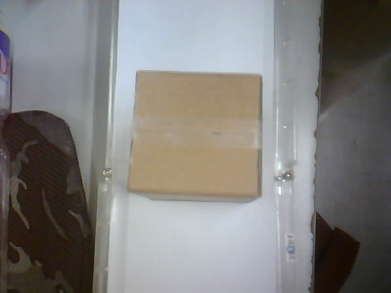
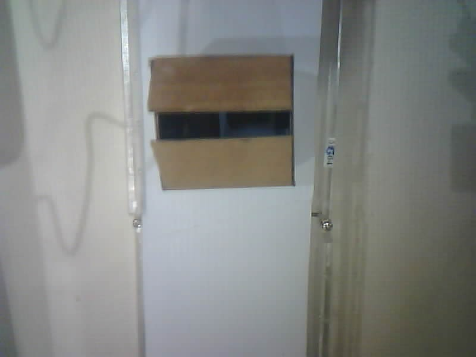
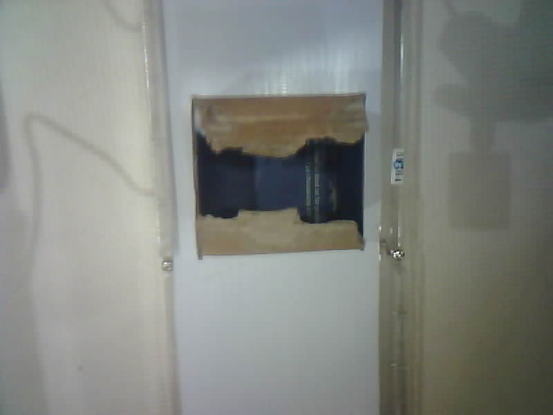
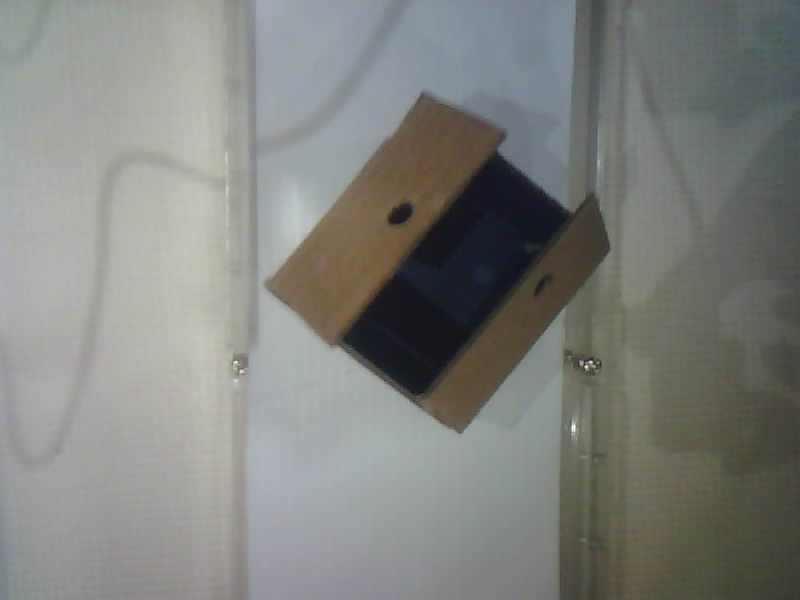
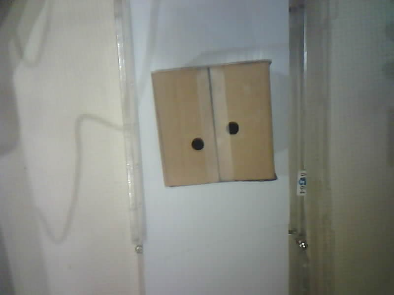
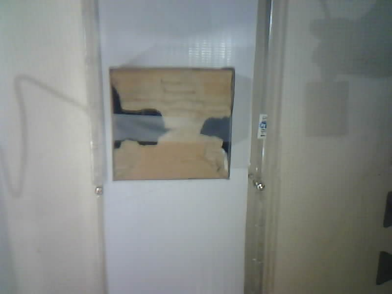

# Computer Vision–Based Carton Defect Detection and Sorting (Prototype)

## Overview
This project is a prototype **quality control + sorting system** for packaging cartons on a conveyor. It uses a **YOLO-based object detection model** to identify the carton condition from a camera feed, then sends a command to a microcontroller to **physically route** the carton to the correct path (e.g., **defective** vs **pass**).

The goal is to simulate an intelligent inspection step in a production line using low-cost components and real-time inference.

---

## What it does
- Captures live video using an **ESP32-CAM** (MJPEG stream over Wi-Fi).
- Runs **real-time detection/classification** in Python using a trained **YOLOv8n** model.
- Focuses detection on a defined **inspection zone** in the camera frame.
- Sends a simple label to a microcontroller via **serial**:
  - `"defect"` → triggers sorting to the defect lane + turns indicator LED on
  - `"clear"` → allows pass lane + turns indicator LED off
- Uses a **servo motor** as the diverter mechanism for sorting.

---

## Defect classes
The model is trained to detect and classify cartons into these labels:
- **sealed**
- **open**
- **torn**
- **hole**
- **box** (general carton class)

### Sample images per class

| sealed | open | torn |
|---|---|---|
|  |  |  |

| hole | hole-sealed | torn-sealed |
|---|---|---|
|  |  |  |

For sorting logic, the system treats **sealed** as pass (`"clear"`) and **open/torn/hole** as fail (`"defect"`).

---

## Model training summary
- Collected **170 labeled images**
- Applied data augmentation (e.g., flipping/rotation) to expand to **510 images**
- Dataset split:
  - **408** training images
  - **102** validation images
- Reported performance metrics (YOLO training summary):
  - **Precision:** 0.872  
  - **Recall:** 0.948  
  - **mAP@50:** 0.970  
  - **mAP@50–95:** 0.796  

---

## System architecture
1. **ESP32-CAM** streams live video over Wi-Fi (MJPEG).
2. A **Python script**:
   - pulls frames from the stream,
   - runs YOLO inference,
   - checks detections inside a center “inspection zone,”
   - decides whether the carton is `"defect"` or `"clear"`.
3. The script sends the decision to an **Arduino** over serial.
4. The **Arduino** controls:
   - a **servo motor** (diverter position)
   - a **blue LED** (status indicator)
5. The carton continues along the **conveyor belt** and is routed based on the diverter position.

---

## Hardware used 
- ESP32-CAM (Wi-Fi camera module)
- Arduino (for actuator/indicator control)
- Servo motor (diverter)
- Conveyor belt with 12V DC motor
- LED indicator
- DC power supply (12V) and step-down regulation (e.g., LM2596 module)
- Wires/connectors and mounting materials (prototype frame)

---

## Software  
- **Python 3**
  - OpenCV (`cv2`)
  - Ultralytics YOLO
  - PySerial (`serial`)
  - Requests (for stream access)
- **Arduino IDE**
  - Servo library (standard)

---

## How to run (high level)
1. **Start the ESP32-CAM stream**
   - Ensure the camera is connected to Wi-Fi and the MJPEG stream URL is accessible.
2. **Connect the Arduino**
   - Plug into the computer that runs the Python script (note the COM/serial port).
3. **Configure the Python script**
   - Set:
     - the ESP32-CAM stream URL
     - the serial port and baud rate
     - the YOLO model path/weights
4. **Run detection**
   - The script displays the stream, performs inference, and sends `"defect"` / `"clear"` when a carton is detected in the inspection zone.
5. **Test sorting**
   - Place cartons on the conveyor and verify diverter action and LED behavior.

---

## Notes / limitations
- Performance depends heavily on **lighting**, **camera angle**, and **dataset coverage** of defects.
- A lightweight prototype frame may introduce alignment and mechanical stability issues (servo push force, belt traction, etc.).
- The system is designed for **demonstration and learning**; additional safety measures are required for real industrial deployment.

---

## Possible improvements
- Expand dataset (more defect variations, backgrounds, lighting conditions).
- Add better mechanical diverter design (stronger actuator, guide rails).
- Improve decision logic (track cartons across frames to reduce flicker).
- Add logging (timestamps, counts, and defect statistics) for QA reporting.
